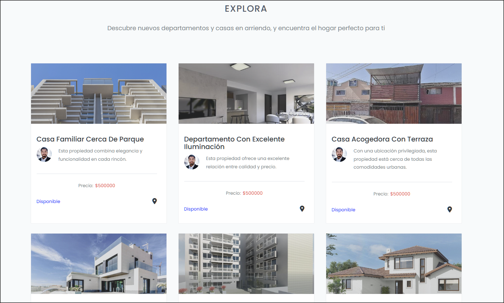
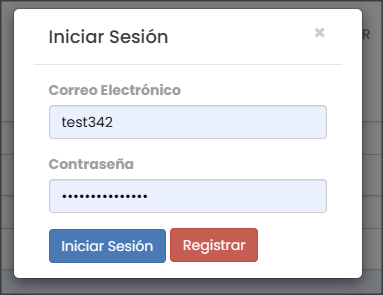
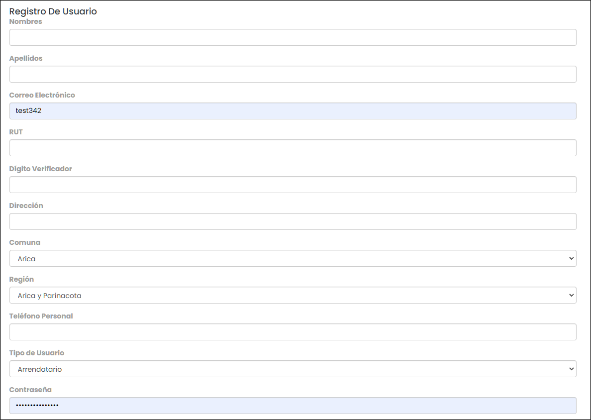
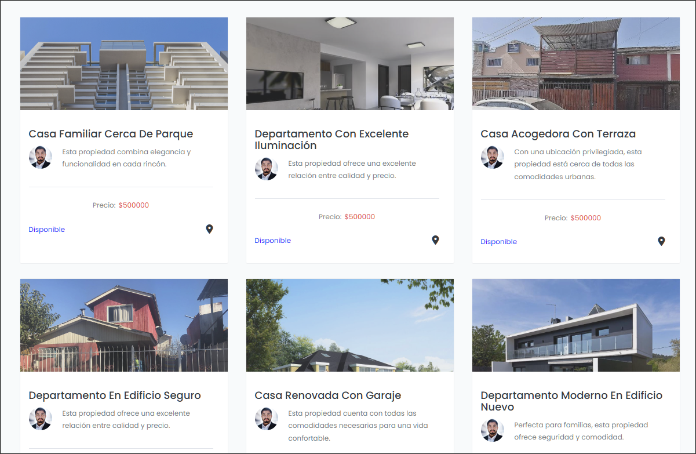
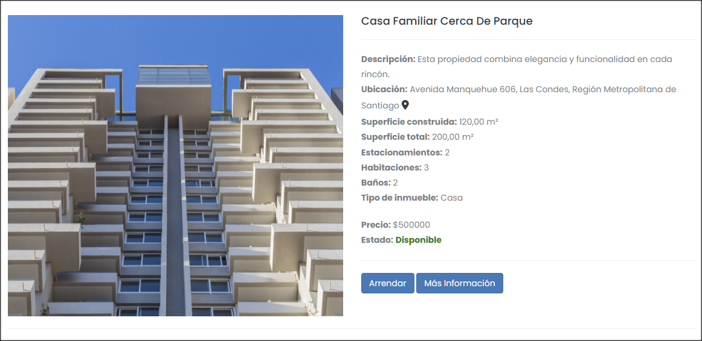

# Proyecto de Gestión de Arriendos - Hito 4

Este proyecto es una aplicación web desarrollada en Django para gestionar el arriendo de inmuebles. En esta etapa, se han implementado funcionalidades clave para que los arrendadores puedan gestionar sus propiedades y los arrendatarios puedan visualizar las ofertas disponibles.

## Funcionalidades Implementadas

### 1. Gestión de Inmuebles por Arrendadores

Los arrendadores pueden agregar nuevos inmuebles, así como actualizar o eliminar los inmuebles existentes.

- **Agregar Inmueble:** Los arrendadores pueden agregar nuevas propiedades para arriendo.
- **Actualizar/Borrar Inmueble:** Los arrendadores pueden actualizar la información de un inmueble existente o eliminarlo del sistema.

### 2. Visualización de Inmuebles por Arrendatarios

Los arrendatarios pueden visualizar todas las propiedades disponibles para arriendo.

- **Ver Inmuebles Disponibles:** Los arrendatarios pueden explorar las ofertas de inmuebles para arriendo.

## Estructura de la Base de Datos

El proyecto utiliza los siguientes modelos:

- `Usuario`: Gestiona los datos de los usuarios registrados.
- `TipoUsuario`: Define los tipos de usuarios (Arrendatario, Propietario, etc.).
- `Region`: Registra las regiones de Chile.
- `Comuna`: Registra las comunas asociadas a una región.
- `Inmueble`: Gestiona la información de los inmuebles disponibles para arriendo.

## Requisitos

- Python 3.x
- Django 3.x
- SQLite (base de datos predeterminada)

## Uso de la Aplicación

### 1. Agregar Inmuebles

Los arrendadores pueden agregar nuevas propiedades a través de la página de creación de inmuebles.

### 2. Actualizar/Borrar Inmuebles

Los arrendadores pueden actualizar la información de las propiedades existentes o eliminarlas.

### 3. Ver Inmuebles Disponibles

Los arrendatarios pueden ver todas las propiedades disponibles para arriendo en una página dedicada a listar las ofertas.

## Plantillas

La aplicación utiliza plantillas basadas en Bootstrap para una interfaz simple y responsive. Las plantillas incluyen:

- `base.html`: Plantilla base que incluye la barra de navegación y estructura general.
- `form_inmueble.html`: Formulario utilizado tanto para crear como para editar inmuebles.
- `list_inmuebles.html`: Muestra una lista de los inmuebles disponibles.
- `detail_inmueble.html`: Muestra los detalles de un inmueble específico.

## Navegación en la Aplicación

En la barra de navegación, los usuarios pueden:

- **Ver Inmuebles:** Acceder a la lista de inmuebles disponibles.
- **Agregar Inmueble:** Crear una nueva propiedad si están autenticados como arrendadores.
- **Login/Logout:** Iniciar o cerrar sesión según el estado de autenticación.

## Capturas de Pantalla

Aquí se muestran algunas capturas de pantalla de la aplicación en funcionamiento:

- **Imagen 1:** Página de inicio.

- **Imagen 2:** Formulario de login.

- **Imagen 3:** Formulario de registro.

- **Imagen 4:** Lista de inmuebles.

- **Imagen 5:** Detalles de un inmueble.
